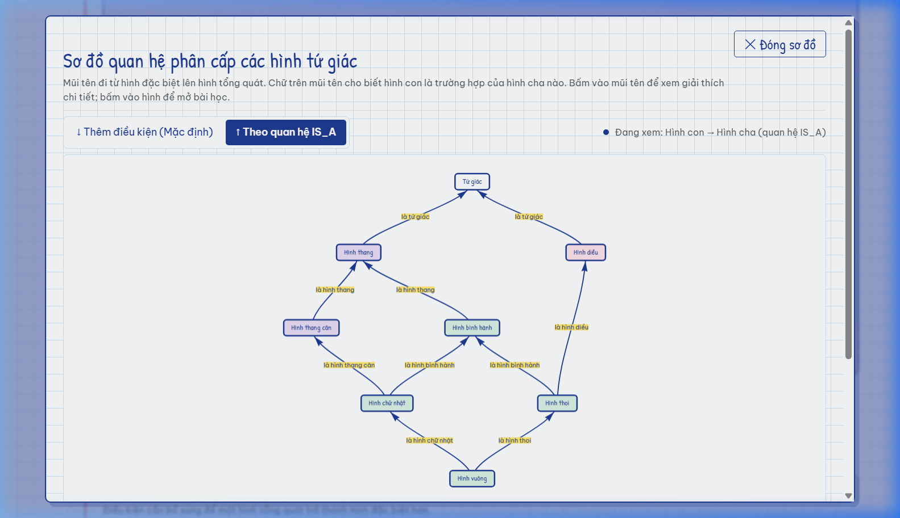
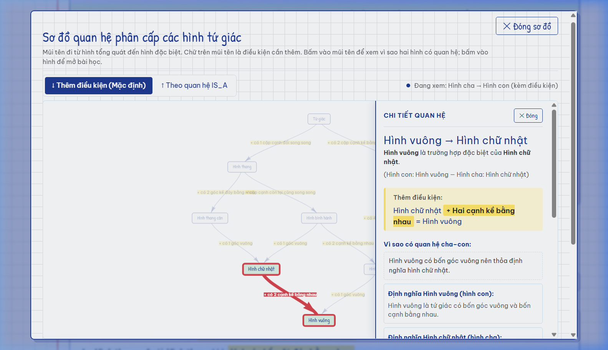
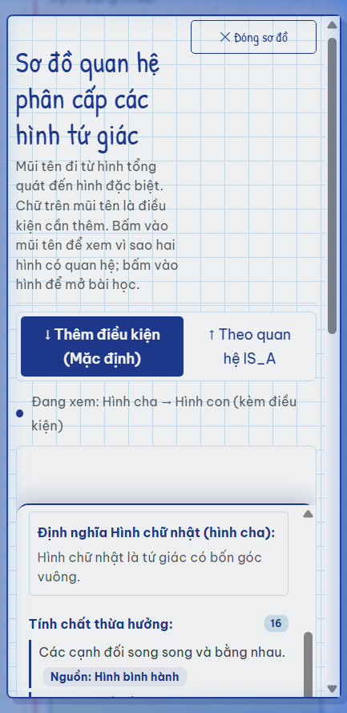
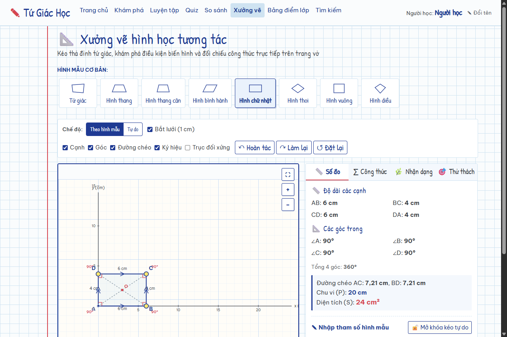
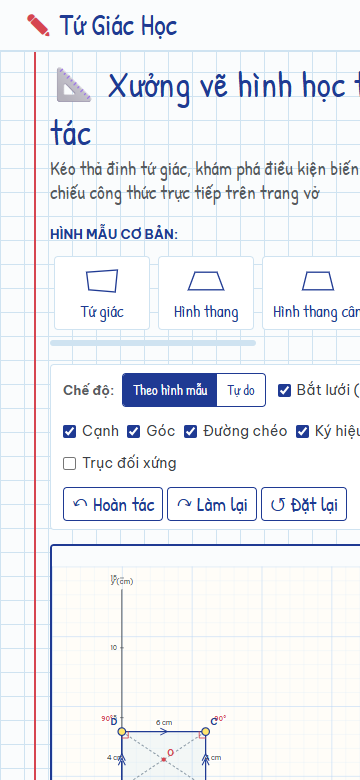

# CẨM NANG HƯỚNG DẪN SỬ DỤNG HỆ THỐNG HỌC HÌNH TỨ GIÁC
> **Dành cho học sinh, giáo viên và người học hình học phẳng lớp 8**

---

## 1. Giới thiệu tổng quan & Phong cách học tập

Chào mừng bạn đến với **Tứ Giác Học** — website học tập hình học phẳng tương tác được thiết kế riêng theo phong cách **Trang vở học sinh**:
- Nền giấy kẻ ô li 24px thân thuộc, đường kẻ lề đỏ viết mực bên trái.
- Phông chữ viết tay (*Patrick Hand*) kết hợp chữ in học thuật (*Be Vietnam Pro*).
- 8 hình vẽ tứ giác bằng nét vẽ tay chuyển động sống động (*Hand-drawn SVG*).
- Công thức toán học trực quan viết bằng chuẩn kí hiệu KaTeX.
- Toàn bộ tri thức được kết nối bằng **Cơ sở dữ liệu đồ thị Neo4j**, giúp bạn thấy rõ mối liên hệ họ hàng và tính chất kế thừa giữa các hình học.

---

## 2. Hướng dẫn từng chức năng chi tiết

### 2.1. Trang chủ (`/`)
- **8 Khối hình học tương tác:** Hiển thị 8 hình tứ giác: Tứ giác, Hình thang, Hình thang cân, Hình bình hành, Hình chữ nhật, Hình thoi, Hình vuông và Hình diều. Khi rê chuột (hover) vào hình, nét vẽ sẽ nổi bật. Nhấp vào bất kỳ hình nào để chuyển thẳng đến trang lý thuyết chi tiết của hình đó.
- **Sơ đồ phân cấp thu nhỏ:** Mô tả trực quan 5 tầng phân loại từ Tứ giác tổng quát đến Hình vuông.
- **5 Lối vào bài học dạng gạch đầu dòng bút chì (`✎`):**
  1. *Khám phá lý thuyết:* Xem toàn bộ các hình và tính chất.
  2. *Sơ đồ phân cấp đồ thị:* Mở đồ thị tương tác mạng lưới.
  3. *Luyện tập theo hình:* Làm bài tập củng cố 5 câu của từng hình.
  4. *Kiểm tra tổng hợp Quiz:* Đề thi 10 câu bao quát toàn diện.
  5. *Bảng điểm lớp:* Xem bảng xếp hạng và thi đua học tập.

---

### 2.2. Khám phá lý thuyết chi tiết (`/shapes/{slug}`)
Khi mở một hình (ví dụ: *Hình chữ nhật* tại `/shapes/hinh-chu-nhat`):
1. **Định nghĩa:** Được tô nổi bật bằng màu dạ quang vàng (`#FFF3A8`) giúp bạn dễ dàng ghi nhớ khái niệm cốt lõi.
2. **Tính chất của hình:**
   - *Tính chất trực tiếp (nét vẽ màu mực đậm):* Những đặc tính riêng biệt của hình đó (ví dụ: Hình chữ nhật có 2 đường chéo bằng nhau).
   - *Tính chất kế thừa từ tổ tiên (nét vẽ màu tím/xanh nhạt):* Hệ thống tự động truy xuất từ đồ thị Neo4j để chỉ ra tính chất này được thừa hưởng từ hình nào (ví dụ: Kế thừa từ Hình bình hành: "Các cạnh đối song song và bằng nhau").
3. **Định lý & Dấu hiệu nhận biết:** Các phương pháp và dấu hiệu quan trọng để chứng minh một tứ giác hay một hình bình hành trở thành hình này trong các bài thi.
4. **Công thức tính toán:** Chu vi và diện tích được trình bày đẹp mắt dưới dạng công thức toán học KaTeX.
5. **Ví dụ mẫu có lời giải:** Bài toán minh họa thực tế cùng các bước giải chi tiết.
6. **Mục liên kết phả hệ:** Cột bên phải cho biết các hình cha tổng quát hơn và các hình con đặc biệt hơn.

---

### 2.3. Sơ đồ phân cấp đồ thị tương tác (vis-network v2.3)
- Nhấp vào nút **"Xem sơ đồ phân cấp đầy đủ (Đồ thị tương tác) 🌳"** ở đầu các trang để mở cửa sổ đồ thị toàn màn hình.
- **Bố cục hình học 5 tầng cân xứng:**
  - Tầng 1 (Đỉnh): *Tứ giác* tổng quát.
  - Tầng 2: Nhánh *Hình thang* (trái) và Nhánh *Hình diều* (phải).
  - Tầng 3: *Hình thang vuông*, *Hình thang cân*, *Hình bình hành*.
  - Tầng 4: *Hình chữ nhật*, *Hình thoi*.
  - Tầng 5 (Đáy): *Hình vuông* — kết tinh của cả Hình chữ nhật và Hình thoi.
  - Các nhãn điều kiện được thiết kế nằm ngang trên nền dạ quang vàng sáng (`#FFE66D`), chữ mực xanh đậm (`#1F3A93`), viền mảnh tinh tế, không bao giờ bị cắt chéo qua hình.

- **Chuyển đổi 2 chiều đọc trực quan (Segmented Control):**
  - **Chiều 1: "Thêm điều kiện" (Mặc định):**
    - Mũi tên chỉ từ hình cha xuống hình con (ví dụ: *Hình bình hành* $\to$ *Hình thoi*).
    - Nhãn trên cạnh hiển thị điều kiện cần thêm: `+ 2 cạnh kề bằng nhau`, `+ 1 góc vuông`, `+ 2 đường chéo vuông góc`, v.v.
    - Giúp học sinh học thuộc các **dấu hiệu nhận biết** để chứng minh từ hình tổng quát thành hình đặc biệt.
  - **Chiều 2: "Theo quan hệ IS_A":**
    - Bấm nút *"Theo quan hệ IS_A"* trên thanh công cụ đồ thị.
    - Mũi tên quay ngược chiều từ hình con lên hình cha (ví dụ: *Hình vuông* $\to$ *Hình chữ nhật*).
    - Nhãn trên cạnh hiển thị: `là Hình chữ nhật`, `là Hình thoi`.
    - Thể hiện bản chất phân loại phả hệ toán học: Hình con kế thừa mọi tính chất của hình cha.

- **Tương tác thông minh trên cạnh & Node:**
  - *Rê chuột (Hover) lên mũi tên / nhãn:* Mũi tên chuyển màu đỏ bút chấm bài (`#D64550`), con trỏ chuột đổi sang dạng bàn tay (`pointer`).
  - *Bấm vào mũi tên (Click edge):* Cạnh được chọn sẽ bừng sáng với đường nét đỏ đậm (4.5px), hai node đầu mút đổi viền đỏ; toàn bộ các hình và mũi tên khác sẽ được làm mờ nhẹ (`opacity ~ 0.3`) để bạn tập trung cao độ vào cặp hình đang nghiên cứu. Bấm ra khoảng trống ngoài đồ thị để hoàn tác về trạng thái ban đầu.
  - *Bấm vào hình (Click node):* Mở thẳng trang lý thuyết chi tiết của hình tương ứng (`/shapes/{slug}`).

- **Bảng thông tin chi tiết mối quan hệ (Detail Panel 6 mục):**
  Khi bấm vào bất kỳ mũi tên quan hệ nào, một bảng ghi chú dạng sổ tay bìa cứng sẽ mở ra ngay trong giao diện (bên phải trên Desktop, trượt mượt mà từ dưới lên dạng Bottom Sheet trên Mobile):
  1. **Tiêu đề quan hệ:** Tên hình cha $\to$ Tên hình con kèm câu tóm tắt quan hệ.
  2. **Bản chất hình học:** Nhắc nhớ định nghĩa phả hệ cốt lõi (ví dụ: *"Hình vuông là một hình thoi đặc biệt khi có thêm 1 góc vuông hoặc 2 đường chéo bằng nhau"*).
  3. **Điều kiện cần & đủ:** Liệt kê đầy đủ tất cả các dấu hiệu hình học để chuyển hóa từ hình cha sang hình con theo chuẩn SGK.
  4. **Lý do hình học (Chứng minh ngắn gọn):** Giải thích căn cứ toán học logic vì sao khi bổ sung điều kiện đó thì các tính chất khác tự động thỏa mãn.
  5. **Tính chất thừa hưởng (Kế thừa từ hình cha):** Mục bấm gập/mở (accordion) liệt kê tất cả các tính chất về cạnh, góc, đường chéo mà hình con nghiễm nhiên thừa hưởng từ hình cha.
  6. **Lối tắt bài học:** Hai nút chuyển nhanh đến trang bài học đầy đủ của *Hình cha* và *Hình con*.

- **Đóng bảng & Thoát sơ đồ:**
  - Bấm nút **✕** trên đầu bảng chi tiết để đóng bảng (sơ đồ sẽ sáng lại bình thường).
  - Bấm phím **Escape (Esc)**: Nếu bảng chi tiết đang mở, phím Esc sẽ đóng bảng trước; nếu không có bảng chi tiết, phím Esc sẽ đóng toàn bộ cửa sổ sơ đồ.
  - Nút **"✕ Đóng sơ đồ"** trên thanh tiêu đề luôn hiển thị rõ ràng trên một dòng duy nhất, không bao giờ bị ngắt dòng ngay cả trên điện thoại nhỏ (360px).

---

### 2.4. Luyện tập theo từng hình (`/practice` & `/practice/{slug}`)
- Vào mục **Luyện tập** trên thanh thực đơn và chọn hình bạn muốn rèn luyện (ví dụ: *Hình thang cân*).
- Mỗi hình gồm **5 câu hỏi trắc nghiệm** đa dạng:
  - Câu hỏi *Lý thuyết* (badge màu xanh dương).
  - Câu hỏi *Tính toán* (badge màu vàng đồng).
  - Câu hỏi *Dấu hiệu nhận biết* (badge màu xanh lá).
- **Cách làm bài:**
  1. Chọn 1 trong 4 phương án A, B, C, D.
  2. Bấm nút **"Kiểm tra đáp án"**:
     - Nếu chọn đúng: Ô đáp án chuyển sang màu xanh lá cùng thông báo `✓ Chính xác! Bạn đã chọn đúng.`.
     - Nếu chọn sai: Ô đáp án bạn chọn sẽ bị gạch chéo đỏ, đồng thời ô đáp án đúng được làm nổi bật màu xanh lá.
  3. Bấm nút **"Xem lời giải"** để mở khung giải thích chi tiết trích xuất từ ngân hàng câu hỏi.
  4. Bấm liên kết **"Câu tiếp theo ↓"** để cuộn mượt mà đến câu hỏi kế tiếp.

---

### 2.5. Bài kiểm tra tổng hợp Quiz 10 câu (`/quiz`)
- Đề kiểm tra tổng hợp gồm **10 câu hỏi ngẫu nhiên** được hệ thống tự động chọn lọc để bao phủ toàn bộ 8 hình tứ giác.
- **Thanh tiến độ dính theo màn hình (Sticky Progress Bar):**
  - Hiển thị số câu đã làm (ví dụ: `4 / 10 câu`), tỉ lệ % hoàn thành.
  - Hàng nút từ 1 đến 10 giúp bạn bấm chuyển nhanh đến câu hỏi bất kỳ; số câu đã làm sẽ đổi sang màu mực xanh tím đậm.
- **Nộp bài thi:**
  - Khi làm xong, bấm nút **"Hoàn tất & Nộp bài kiểm tra ✍"**.
  - Hệ thống sẽ hiển thị một **Hộp thoại sổ vở xác nhận**: Nếu bạn còn câu hỏi nào bỏ sót, hộp thoại sẽ cảnh báo cụ thể (ví dụ: *Bạn vẫn còn 2 câu chưa trả lời (Câu 3, Câu 7)*).
  - Xác nhận nộp để gửi bài lên máy chủ chấm điểm.
- **Xem kết quả & Lời phê của giáo viên (`/quiz/result/{quizId}`):**
  - **Con dấu điểm đỏ viết tay:** Điểm số được khoanh tròn đỏ nghiêng nhẹ như nét bút chấm bài của cô giáo: số câu đúng `8/10` kèm điểm quy đổi `80/100 ĐIỂM`.
  - **Lời nhận xét sư phạm:** Giáo viên để lại lời phê khuyến khích tùy theo kết quả bài làm.
  - **Xem lại chi tiết 10 câu:** Rà soát lại từng câu hỏi, thấy rõ phương án mình đã chọn, đáp án đúng và lời giải chi tiết của từng câu để rút kinh nghiệm.

---

### 2.6. Bảng điểm lớp & Đổi tên hiển thị (`/leaderboard`)
- **Bảng điểm vinh danh:** Bảng vàng ghi nhận Top 10 học sinh có điểm thi cao nhất trường. Các thứ hạng 1, 2, 3 được trao huy chương vàng 🥇, bạc 🥈, đồng 🥉 danh dự.
- **Đánh dấu cá nhân:** Dòng kết quả của chính bạn sẽ được hệ thống tự động tô màu dạ quang vàng nổi bật.
- **Đổi họ tên học sinh:**
  - Nhập tên của bạn vào ô *"Họ và tên của bạn"* (tối đa 30 ký tự) rồi bấm nút **"Lưu tên ✎"**.
  - Tên mới sẽ lập tức xuất hiện trên thanh thực đơn và trên Bảng điểm lớp!

---

### 2.7. So sánh & Đối chiếu hai hình (`/compare`)
- Khi cần phân biệt hai hình dễ nhầm lẫn (ví dụ: *Hình thoi* vs *Hình chữ nhật*, hoặc *Hình bình hành* vs *Hình vuông*):
  1. Chọn **Hình thứ nhất** và **Hình thứ hai** từ 2 danh sách lựa chọn.
  2. Bấm nút **"So sánh ✎"**.
- **Kết quả đối chiếu:**
  - *Mối quan hệ phả hệ trong đồ thị:* Hệ thống tự động phân tích đồ thị để thông báo hai hình này có quan hệ cha-con hay là hai nhánh anh em cùng chung tổ tiên gần nhất (LCA).
  - *Bảng 2 cột song song:* Xem hình vẽ SVG, định nghĩa và các tính chất riêng biệt của mỗi bên.
  - *Khung điểm tương đồng:* Liệt kê tất cả các tính chất mà CẢ HAI hình cùng sở hữu.
  - *Đối chiếu công thức:* So sánh công thức chu vi và diện tích của hai hình.

---

### 2.8. Tra cứu & Tìm kiếm kiến thức (`/search`)
- Nhập từ khóa bất kỳ vào ô tìm kiếm: ví dụ *"đường chéo"*, *"song song"*, *"vuông góc"*, *"chu vi"*, *"bằng nhau"*, v.v.
- Hệ thống hỗ trợ tìm kiếm cả tiếng Việt có dấu và không dấu trên toàn bộ định nghĩa, tính chất, định lý, dấu hiệu và công thức.
- Bấm vào nút **"Xem chi tiết lý thuyết →"** trên mỗi kết quả để chuyển ngay đến phần kiến thức tương ứng.

---

### 2.9. Xưởng vẽ hình học tương tác (`/lab` - Phiên bản v2.4)
Tab **"Xưởng vẽ"** trên thanh điều hướng là phòng thí nghiệm hình học phẳng sống động, cho phép người học tự do kéo thả, biến đổi hình tứ giác và đối chiếu công thức trực tiếp trên trang vở học sinh:

1. **Bảng vẽ SVG tương tác & Bắt lưới (Snap-to-Grid):**
   - **Tự động vẽ hình trực tiếp:** Khi chọn bất kỳ hình mẫu nào (Tứ giác, Hình thang, Hình bình hành, Hình chữ nhật, Hình thoi, Hình vuông, Hình diều...), web tự động dựng ngay hình vẽ tương ứng ở trung tâm bảng vẽ với đầy đủ cạnh, đỉnh, góc, số đo và ký hiệu.
   - **Lưới ô li 24px:** Tương ứng 1 ô = 1 cm trong hệ tọa độ toán học.
   - **Tương tác đa dạng:** Kéo thả 4 đỉnh A, B, C, D bằng chuột, cảm ứng chạm trên điện thoại hoặc bàn phím (Tab để chọn đỉnh, phím mũi tên để di chuyển, Shift + mũi tên để nhảy 5 bước).
   - **Bắt lưới thông minh:** Tùy chọn bật/tắt hút điểm chuẩn xác vào các mắt lưới 1 cm.
   - **Bảo toàn tính lồi:** Hệ thống tự động từ chối các vị trí làm tứ giác bị lõm hoặc tự cắt, rung nhẹ viền đỏ và hướng dẫn bằng tiếng Việt.

2. **Hai chế độ làm việc linh hoạt:**
   - **Theo hình mẫu (Parametric mode):** Các đỉnh gắn với các tay nắm chuyên biệt (tô màu vàng dạ quang `#FFE66D`). Kéo tay nắm sẽ giữ đúng loại hình học (ví dụ: kéo đỉnh C của hình chữ nhật để đổi chiều dài, chiều rộng). Có nút **"🔓 Mở khóa kéo tự do"** để chuyển sang kéo độc lập.
   - **Tự do (Free mode):** 4 đỉnh kéo độc lập hoàn toàn. Hệ thống nhận dạng liên tục loại hình theo thời gian thực. Có nút **"🔒 Khóa về hình mẫu"** để quay về hình mẫu chuẩn.

3. **Bốn tab ghi chép chuyên sâu:**
   - **📏 Số đo:** Cập nhật tức thì độ dài 4 cạnh, độ dài 2 đường chéo, 4 góc trong, chu vi, diện tích và tọa độ giao điểm O. Cung cấp ô nhập số hai chiều (gõ tọa độ hoặc tham số cạnh để hình tự vẽ lại).
   - **∑ Công thức:** Tự động lấy công thức từ cơ sở dữ liệu Neo4j. Hiển thị dưới dạng KaTeX đẹp mắt với đầy đủ: công thức gốc $\to$ bước thay số cụ thể $\to$ kết quả cuối cùng. Tự động kiểm chứng chéo với diện tích giải tích (hiển thị huy hiệu `✓ Khớp với diện tích tính từ tọa độ`).
   - **🌿 Nhận dạng & Áp dụng điều kiện:**
     - Xác định tên hình cụ thể nhất cùng chuỗi phả hệ kế thừa `IS_A`.
     - Danh sách kiểm tra 6 tính chất hình học đúng/sai (`✓` / `✗`) theo thời gian thực.
     - **Tính năng "Áp dụng điều kiện":** Liệt kê các hình con trực tiếp kèm nút **"Thử điều kiện này"** (ví dụ: từ Hình chữ nhật $\to$ Hình vuông). Bấm nút sẽ tự động biến đổi 4 đỉnh theo quy tắc SGK và thông báo rõ tính chất vừa được bổ sung.
   - **🎯 Thử thách:**
     - *Dạng 1 (Biến hình học):* Thử thách biến đổi hình cha thành hình con (ví dụ: Biến Hình bình hành thành Hình thoi). Kèm nút "💡 Gợi ý" và hệ thống chấm điểm tự động.
     - *Dạng 2 (Đạt kích thước P, S):* Thử thách điều chỉnh hình đạt đúng chu vi và diện tích cho trước với dung sai $\pm 0.02\text{ cm}$.

4. **Lớp hiển thị trực quan:**
   - Tùy chọn bật/tắt linh hoạt các lớp: **Cạnh**, **Góc**, **Đường chéo**, **Ký hiệu tự động** (góc vuông, dấu song song `>`, `>>`, bằng nhau) và **Trục đối xứng** (nét đứt tím thanh lịch).

---

## 3. Lời khuyên giúp học tốt môn Hình học cùng Tứ Giác Học
1. **Đi từ tổng quát đến đặc biệt:** Bắt đầu từ *Tứ giác*, chuyển dần xuống *Hình thang*, *Hình bình hành*, và đích đến là *Hình vuông*.
2. **Quan sát tính kế thừa:** Mỗi khi học một hình mới, hãy chú ý xem hình đó kế thừa những tính chất gì từ hình cha để không cần học vẹt.
3. **Luyện tập đều đặn:** Hoàn thành 5 câu trắc nghiệm sau mỗi bài học lý thuyết trước khi thử sức với bài kiểm tra tổng hợp Quiz 10 câu.
4. **Sử dụng công cụ so sánh:** Bất cứ khi nào phân vân giữa hai hình, hãy dùng trang `/compare` để nắm chắc điểm khác biệt!

*Chúc các bạn học sinh học tập thật vui và đạt điểm số cao trong môn Toán!* ✎
